# imp1sh.ansible_managemynetwork.ansible_borgmatic

This role fully automates the setup process of [borg backup](https://www.borgbackup.org/), using [borgmatic](https://torsion.org/borgmatic/). Borgmatic is a wrapper for borg that makes several tasks much easier, for example backing up MySQL / MariaDB or PostgreSQL databases or integrating notifications.

Supported OS:
- Debian
- Container
- ~~Fedora~~ (May work but basically deprecated)

Requirements:
- [imp1sh.ansible_managemynetwork.ansible_packages](https://wiki.junicast.de/en/junicast/docs/AnsibleManagemynetworkCollection/rolePackages)

This role supports running on Debian as well as in a container (tested on podman).
For container see also docs of the [imp1sh.ansible_managemynetwork.ansible_podman](https://github.com/imp1sh/ansible_managemynetwork/tree/main/roles/ansible_openwrtpodman) role.
If running on normal OS this role installs borg / borgmatic via pip. The command will be `borgmatic_venv`. Using pip is the recommended way. If you don't want to use pip set `borgmatic_via_pip: false` and `borgmatic_apprise_via_pip: false` as well.

When using **ssh** as backend this role can also handle the necessary key based tasks, so Ansible needs access to the backup target machine as well.

## Configuration
Here is a sample config for a case using SSH based authentication.

```yaml
# better encrypt your passphrase!
borgmatic_encpassphrase: !vault |
          $ANSIBLE_VAULT;1.1;AES256
          62373162376264353131353664303738303866346532303966616261336366306461653234363164
          [...]
          61373138303266333139

borgmatic_compression: "zstd" # zstd more efficient but slightly slower than default lzo

# Source directories, what to backup.
borgmatic_srcdirs:
  - "/mnt/source"

# Then again you might want to exclude stuff again
borgmatic_excludepatterns:
  - "/mnt/source/elasticsearch/1/index"
  - "/mnt/source/loki/rx1/data/chunks"
  - "/mnt/source/prometheus/libcom/data"
  - "/mnt/source/kiwix/0/data"

# How long you want to keep your backup (retention)
borgmatic_keepdaily: 9
borgmatic_keepweekly: 2
borgmatic_keepmonthly: 2
# The range in which between is randomized you can define
borgmatic_timer_hourrange_start: 2
borgmatic_timer_hourrange_end: 4

# apprise integration is being overhauled currently
borgmatic_apprise: true
borgmatic_apprise_user: "notify"
borgmatic_apprise_password: "secret"
borgmatic_apprise_hostname: "matrix.libcom.de"
borgmatic_apprise_matrixroom: "!uRjlIhFDS39DSRztLY:libcom.de"
borgmatic_hooks_on_error:
  - "/usr/local/bin/apprise_borgmatic.sh \"{configuration_filename}\" \"{repository}\" \"{error}\""

# you can also include databases, e.g. postgresql
borgmatic_postgresdbs:
  - name: "all"
    hostname: "psql0"
    username: "postgres"
    format: "custom" # for separate restore files, much easier to handle than one big dump file with all databases in it
```
It would be advisable to set the backup target in a group var for your site.
```yaml
borgmatic_repositories:
  backupuser@target0:
    type: "ssh://"
    targetuser: backupuser
    targethost: target0.example.com
    subdir: myhost
    enabled: true
  backupuser@target1:
    type: "ssh://"
    targetuser: backupuser
    targethost: target1.example.com
    subdir: somedir
    enabled: false
```
If you don't want to manage the ssh keys maybe because you just lack control over backup target machine, set
```yaml
borgmatic_ssh_manage: False
```

## Workflow

The following flowchart visualizes how the role works:

```mermaid
flowchart TD
    Start([main.yml Start]) --> CheckMode{Container<br/>mode?}
    
    CheckMode -->|No| NonContainer[Non-Container Tasks]
    CheckMode -->|Yes| Container[Container Tasks]
    
    NonContainer --> LoadOSVars[Load OS vars<br/>distribution specific]
    LoadOSVars --> CheckPip{Install via<br/>pip?}
    
    CheckPip -->|Yes| SetAbsent[Set package_state: absent]
    CheckPip -->|No| SetPresent[Set package_state: present]
    
    SetAbsent --> Install[1install.yml<br/>Install borg/borgmatic]
    SetPresent --> Install
    
    Install --> InstallRequirements[Install package<br/>requirements]
    Install --> CheckPipInstall{via_pip?}
    
    CheckPipInstall -->|Yes| PipBlock[Install via pip:<br/>- borgbackup<br/>- borgmatic<br/>- apprise if enabled]
    CheckPipInstall -->|No| PackageBlock[Install via package manager:<br/>- borgbackup<br/>- borgmatic]
    
    PipBlock --> DeployWrapper[Deploy venv wrapper script]
    PackageBlock --> DeployWrapper
    
    DeployWrapper --> CreateConfigDir[Create config directory]
    CreateConfigDir --> CheckSystemd{Systemd<br/>manage?}
    
    CheckSystemd -->|Yes| SystemdTimer[4systemd_timer.yml<br/>Create systemd service<br/>Create systemd timer<br/>Enable and start timer]
    CheckSystemd -->|No| SSHSetup
    
    SystemdTimer --> SSHSetup{SSH<br/>manage?}
    
    SSHSetup -->|Yes| LoopRepos[Loop over repositories]
    SSHSetup -->|No| GenerateConfig
    
    LoopRepos --> RepoType{Repository<br/>type?}
    
    RepoType -->|borgbase| BorgbaseSetup[5ssh.yml - Borgbase:<br/>Create SSH key at Borgbase<br/>Create repository<br/>Register host key<br/>Add to known_hosts]
    RepoType -->|ssh://| SSHRepoSetup[5ssh.yml - SSH:<br/>Generate root SSH key<br/>Add public key to target<br/>Register host key<br/>Add to known_hosts]
    
    BorgbaseSetup --> MoreRepos{More<br/>repos?}
    SSHRepoSetup --> MoreRepos
    
    MoreRepos -->|Yes| LoopRepos
    MoreRepos -->|No| GenerateConfig[Generate borgmatic config<br/>config.yaml.jinja2]
    
    GenerateConfig --> InitRepo[Init repository<br/>borgmatic init --encryption repokey]
    InitRepo --> End([End])
    
    Container --> LoadContainerVars[Load Container.yml vars]
    LoadContainerVars --> CreateSSHDir[Create SSH directory]
    CreateSSHDir --> LoopReposContainer[Loop over repositories]
    
    LoopReposContainer --> RepoTypeContainer{Repository<br/>type?}
    
    RepoTypeContainer -->|borgbase| BorgbaseContainer[5ssh_container_repositories.yml:<br/>Generate SSH key<br/>Create key at Borgbase<br/>Create repository<br/>Register host key]
    RepoTypeContainer -->|ssh://| SSHContainer[5ssh_container_repositories.yml:<br/>Generate SSH key<br/>Add public key to target<br/>Register host key]
    
    BorgbaseContainer --> MoreReposContainer{More<br/>repos?}
    SSHContainer --> MoreReposContainer
    
    MoreReposContainer -->|Yes| LoopReposContainer
    MoreReposContainer -->|No| CronSetup[6cron_container.yml<br/>Setup cron job<br/>in container]
    
    CronSetup --> GenerateConfigContainer[Generate borgmatic config<br/>config.yaml.jinja2<br/>in container directory]
    GenerateConfigContainer --> EndContainer([End<br/>Note: Repository init<br/>done separately via<br/>init_container.yml])
    
    style Start fill:#90EE90
    style End fill:#FFB6C1
    style EndContainer fill:#FFB6C1
    style CheckMode fill:#FFE4B5
    style CheckPip fill:#FFE4B5
    style CheckPipInstall fill:#FFE4B5
    style CheckSystemd fill:#FFE4B5
    style SSHSetup fill:#FFE4B5
    style RepoType fill:#E6E6FA
    style RepoTypeContainer fill:#E6E6FA
    style MoreRepos fill:#E6E6FA
    style MoreReposContainer fill:#E6E6FA
```



## Repositories examples
Here's an example for a *hetzner* backup:
```yaml
borgmatic_repositories:
  u200000@u200000.your-storagebox.de:
    type: "ssh://"
    targetuser: u200000
    targethost: u200000.your-storagebox.de
    subdir: fsn1
    enabled: true
```
This one is for [borgbase - a really nice and affordable backup target storage provider](https://www.borgbase.com/). Have this role installed as well: [adhawkins.borgbase](https://github.com/adhawkins/ansible-borgbase). This role will setup ssh keys and borgbase repos for you automatically.
```yaml
borgmatic_repositories:
  borgbase0:
    type: "borgbase"
    enabled: true
```

## Containermode

Instead of running borgmatic on the host itself it can also be run within a container. Set those vars:
```yaml
# Enable containermode
borgmatic_containermode: True
# Set the path for the crontab file
borgmatic_cronfile: "/mnt/cntr/unsynced/borgmatic/0/borgmatic.d/crontab.txt"
# Enable or disable cronjob with this
borgmatic_cronstate: "present"
# This is where the ssh keys will be put
borgmatic_sshdir: "/mnt/cntr/unsynced/borgmatic/0/ssh/"
# This is where borgmatic config will be put
borgmatic_confdir: "/mnt/cntr/unsynced/borgmatic/0/borgmatic.d/"
# This parameter is not container specific but this is the default mount point where you mount into your container so it will be backed up. Normally you don't have to give any other dir, just mount everything you want to backup into this dir in the container. Don't forget to define excludes based on this dir
borgmatic_srcdirs:
  - "/mnt/source"
```

Here's also an example of a podman definition so you can see how the mounting typically goes.
```yaml
podman_containers:
  - name: borgmatic_nasofden1
    state: started
    network: podmannetGUA
    # this is quite important so your repository carry a speaking name
    hostname: "{{ inventory_hostname }}"
    image: ghcr.io/borgmatic-collective/borgmatic
    volume:
      - "/mnt/cntr/unsynced/borgmatic/0/repository/:/mnt/borg-repository/"
      - "/mnt/cntr/unsynced/borgmatic/0/borgmatic.d/:/etc/borgmatic.d/"
      - "/mnt/cntr/unsynced/borgmatic/0/config/:/root/.config/borg/"
      - "/mnt/cntr/unsynced/borgmatic/0/ssh/:/root/.ssh/"
      - "/mnt/cntr/unsynced/borgmatic/0/root/:/root/.local/state/borgmatic/"
      - "/mnt/cntr/unsynced/:/mnt/source/:ro"
      # I added those because borgmatic is no more running on the host but I also want those host's folders backed up
      - "/etc/:/mnt/source/etc/:ro"
      - "/opt/:/mnt/source/opt/:ro"
      - "/home/:/mnt/source/home/:ro"
      - "/root/:/mnt/source/root/:ro"
    env:
      TZ: "Europe/Berlin"
```

When running borgmatic in a container you need to run the `ansible_podman` role and enable the borgmatic plugin. The `ansible_podman` role then will also run the `ansible_borgmatic` role and take care of everything. This is how you enable the plugin for the container borgmatic0. I keep naming the container for backup the same on every host so I can define this on a group var scope in ansible

```
podman_container_plugin_borgmatic:
  - "borgmatic0"
```

This is an example of calling the podman role. It will also setup borgmatic within that very run so no need to call the borgmatic role directly.

```
ansible-playbook playbooks/podman.yml -l nas1.libcom.de -e podman_limited_containers=borgmatic0 --ask-vault-pass
```

This is my playbook file:
```yaml
- name: "MMN Podman Role"
  hosts: tags_podman
  become: true
  roles:
    - imp1sh.ansible_managemynetwork.ansible_podman
```
Those vars I typically define on a group scope level, so this is the same for every host that will run borgmatic in a container.

```yaml
# what is the container name (needed for restarts etc.)
borgmatic_containername: "borgmatic0"
# Enable containermode so when running this role on a host in containermode won't break things
borgmatic_containermode: True
# the cronfile is to be expected in a specific dir
borgmatic_cronfile: "/mnt/cntr/unsynced/borgmatic/0/borgmatic.d/crontab.txt"
borgmatic_cronstate: "present"
# here the ssh keys and stuff are in
borgmatic_sshdir: "/mnt/cntr/unsynced/borgmatic/0/ssh/"
# config directory, also cron file normally is put here
borgmatic_confdir: "/mnt/cntr/unsynced/borgmatic/0/borgmatic.d/"
# name the container the borg runs in
borgmatic_containername: "borgmatic0"
```


## Scheduling

Backups are scheduled via systemd timer by default. When running borgmatic in containermode it will use cron. The time when it will run will be daily randomized between 1 and 6 in the morning. You can override the time directly. It's recommended to define static values, otherwise each ansible run new timers will be randomized which might be unwanted.
```yaml
borgmatic_timer_hour: 1
borgmatic_timer_minute: 3
```
or define another range within which the time will be randomized
```yaml
borgmatic_timer_hourrange_start: 1
borgmatic_timer_hourrange_end: 6
borgmatic_timer_minuterange_start: 1
borgmatic_timer_minuterange_end: 59
```
You can also define the OnCalender value directly by setting the var `borgmatic_timer_schedule`. [Look Arch wiki](https://wiki.archlinux.org/title/Systemd/Timers#Realtime_timer) for more information on the format.
If you don't want to have the systemd job managed via the role, set
```yaml
borgmatic_systemd_manage: False
```

## Apprise notification
Since borgmatic 1.8.3 [apprise](https://github.com/caronc/apprise) integration has gotten much better so my old method is now deprecated.
It is a good idea to get notified when something goes wrong during the backup process.
Just define a dict var carrying the apprise parameters

```yaml
borgmatic_apprise:
  services:
    - url: "matrixs://username:{{ borgmatic_apprise_password }}@matrix.example.com/!roomid"
      label: "Matrix"
      fail:
        title: "Borgmatic backup fail event"
        body: "Failed borgmatic backup on host {{ inventory_hostname }}"
      states:
        - fail
borgmatic_apprise_password: !vault |
          $ANSIBLE_VAULT;1.1;AES256
          33336534653530626531356330616333343135363831396632303133633430643430636332666531
          [...]
          6137
```
The roomid might look something like this: `!zEWDASjFsFzJwNIhN:envs.net`

## Database Backups

### PostgreSQL

The role supports backing up PostgreSQL databases. Here's an example configuration:

```yaml
borgmatic_postgresdbs:
  - name: "all"  # or specific database name
    hostname: "psql0"
    username: "postgres"
    format: "custom"  # for separate restore files, much easier to handle than one big dump file
    port: 5432  # optional, defaults to 5432
    password: "{{ postgres_password }}"  # optional, can use .pgpass file
    ssl_mode: "require"  # optional
    ssl_cert: "/path/to/cert"  # optional
    ssl_key: "/path/to/key"  # optional
    ssl_root_cert: "/path/to/ca.crt"  # optional
    ssl_crl: "/path/to/crl"  # optional
    options: "--verbose"  # optional pg_dump options
```

### MySQL / MariaDB

The role also supports backing up MySQL/MariaDB databases:

```yaml
borgmatic_mysqldbs:
  - name: "mydatabase"  # or "all" for all databases
    hostname: "mysql0"
    username: "backup"
    password: "{{ mysql_password }}"  # optional, can use .my.cnf
    port: 3306  # optional, defaults to 3306
    options: "--single-transaction"  # optional mysqldump options
    tls: true  # optional, enable TLS
```

## Repository Configuration

### Repository Options

Each repository in `borgmatic_repositories` can have additional options:

```yaml
borgmatic_repositories:
  backupuser@target0:
    type: "ssh://"
    targetuser: backupuser
    targethost: target0.example.com
    subdir: myhost
    enabled: true
    label: "My Backup Label"  # optional, custom label for the repository
    encryption: "repokey"  # optional, encryption mode (repokey, keyfile, etc.)
    append_only: false  # optional, make repository append-only
    storage_quota: "100G"  # optional, storage quota
    make_parent_directories: true  # optional, create parent directories if needed
```

### Borgbase Integration

For Borgbase integration, you need to install the `adhawkins.borgbase` Ansible collection and provide an API key:

```yaml
borgmatic_borgbase_apikey: !vault |
  $ANSIBLE_VAULT;1.1;AES256
  [your encrypted API key]

borgmatic_repositories:
  borgbase0:
    type: "borgbase"
    enabled: true
```

The role will automatically:
- Create SSH keys at Borgbase
- Create the repository
- Configure SSH known hosts

## Advanced Configuration Options

### Compression

Choose compression algorithm (default: `lz4`):

```yaml
borgmatic_compression: "zstd"  # Options: lz4, zstd, zlib, lzma, auto, none
```

### Retention Policies

Configure how long to keep backups:

```yaml
borgmatic_keep_within: "1H"  # Keep all archives within this time interval
borgmatic_keep_secondly: 60  # Number of secondly archives to keep
borgmatic_keep_minutely: 60  # Number of minutely archives to keep
borgmatic_keep_hourly: 24    # Number of hourly archives to keep
borgmatic_keep_daily: 7      # Number of daily archives to keep (default: 7)
borgmatic_keep_weekly: 4     # Number of weekly archives to keep
borgmatic_keep_monthly: 12   # Number of monthly archives to keep
borgmatic_keep_yearly: 1     # Number of yearly archives to keep
```

### Exclusion Patterns

Multiple ways to exclude files:

```yaml
# Simple exclude patterns
borgmatic_excludepatterns:
  - "*.tmp"
  - "/mnt/source/cache/*"

# Exclude from file (one pattern per line)
borgmatic_exclude_from:
  - "/etc/borgmatic/excludes.txt"

# Include patterns (what to backup, if specified only matching files are backed up)
borgmatic_patterns:
  - "+ /important"
  - "- *"

# Include patterns from file
borgmatic_patterns_from:
  - "/etc/borgmatic/patterns.txt"

# Exclude caches
borgmatic_exclude_caches: true

# Exclude if file is present
borgmatic_exclude_if_present:
  - ".nobackup"

# Exclude files with nodump flag
borgmatic_exclude_nodump: true

# Exclude tags from retention
borgmatic_keep_exclude_tags:
  - "checkpoint"
```

### Encryption

Configure encryption passphrase:

```yaml
# Per-host passphrase
borgmatic_encpassphrase: !vault |
  $ANSIBLE_VAULT;1.1;AES256
  [encrypted passphrase]

# Global passphrase (fallback)
borgmatic_encpassphrase_global: !vault |
  $ANSIBLE_VAULT;1.1;AES256
  [encrypted passphrase]

# Or use a command to retrieve passphrase
borgmatic_encryption_passcommand: "cat /etc/borgmatic/passphrase"
```

### Advanced Borg Options

```yaml
# Working directory for borg operations
borgmatic_working_directory: "/tmp/borgmatic"

# One filesystem (don't cross filesystem boundaries)
borgmatic_one_file_system: true

# Store numeric IDs instead of user/group names
borgmatic_numeric_ids: true

# Store atime, ctime, birthtime
borgmatic_atime: true
borgmatic_ctime: true
borgmatic_birthtime: true

# Read special files (FIFOs, sockets, etc.)
borgmatic_read_special: false

# Files cache (for faster operations)
borgmatic_files_cache: "ctime,size,inode"

# Custom borg/borgmatic paths
borgmatic_local_path: "/usr/local/bin/borg"
borgmatic_remote_path: "/usr/local/bin/borg"

# SSH command
borgmatic_sshcommand: "ssh -i /path/to/key"

# Source directories must exist
borgmatic_source_directories_must_exist: false
```

### Hooks

Execute commands on backup events:

```yaml
borgmatic_hooks_on_error:
  - "/usr/local/bin/notify-backup-failure.sh"
```

## Loki Logging

The role supports sending backup logs to Loki:

```yaml
borgmatic_loki:
  - url: "https://loki.example.com:3100/loki/api/v1/push"
    labels:
      app: "borgmatic"
      hostname: "{{ inventory_hostname }}"
```

## Variables Reference

### Core Variables

| Variable | Default | Description |
|----------|---------|-------------|
| `borgmatic_via_pip` | `true` | Install borg/borgmatic via pip (recommended) |
| `borgmatic_apprise_via_pip` | `true` | Install apprise via pip |
| `borgmatic_ssh_manage` | `true` | Automatically manage SSH keys for repositories |
| `borgmatic_systemd_manage` | `true` | Manage systemd timer/service |
| `borgmatic_containermode` | `false` | Enable container mode |
| `borgmatic_containername` | - | Container name (required in container mode) |

### Path Variables

| Variable | Default (Debian) | Description |
|----------|------------------|-------------|
| `borgmatic_venvdir` | `/opt/venv/borgmatic` | Python virtualenv directory |
| `borgmatic_venv_wrapper` | `/usr/local/sbin/borgmatic_venv` | Wrapper script path |
| `borgmatic_pathconfig` | `/etc/borgmatic` | Configuration directory |
| `borgmatic_fileconfig` | `config.yaml` | Configuration filename |
| `borgmatic_confdir` | - | Config directory (container mode) |
| `borgmatic_sshdir` | - | SSH directory (container mode) |
| `borgmatic_cronfile` | - | Cron file path (container mode) |

### Scheduling Variables

| Variable | Default | Description |
|----------|---------|-------------|
| `borgmatic_timer_hour` | Random | Hour to run backup (0-23) |
| `borgmatic_timer_minute` | Random | Minute to run backup (0-59) |
| `borgmatic_timer_hourrange_start` | `1` | Start of hour range for randomization |
| `borgmatic_timer_hourrange_end` | `6` | End of hour range for randomization |
| `borgmatic_timer_minuterange_start` | `1` | Start of minute range for randomization |
| `borgmatic_timer_minuterange_end` | `59` | End of minute range for randomization |
| `borgmatic_timer_schedule` | - | Custom systemd OnCalendar string |
| `borgmatic_cronstate` | `present` | Cron job state (present/absent) |

### Repository Variables

| Variable | Required | Description |
|----------|----------|-------------|
| `borgmatic_repositories` | Yes | Dictionary of repository configurations |
| `borgmatic_borgbase_apikey` | Yes (if using borgbase) | Borgbase API key |

### Source and Exclusion Variables

| Variable | Default | Description |
|----------|---------|-------------|
| `borgmatic_srcdirs` | `/etc`, `/opt`, `/home`, `/root` | Directories to backup |
| `borgmatic_excludepatterns` | - | List of exclude patterns |
| `borgmatic_exclude_from` | - | List of exclude pattern files |
| `borgmatic_patterns` | - | List of include patterns |
| `borgmatic_patterns_from` | - | List of include pattern files |

## Restore

There are multiple approaches to restore backups:

1. **Dedicated restore container**: Create another container only for restoring that has a restore target RW mounted
2. **Modify existing container**: Mount `/mnt/source` as RW instead of readonly and use borgmatic commands within the container
3. **Add bind mount**: Add a bind mount volume to the existing container and restore into that directory

For hints on defining a dedicated restore container, see the `ansible_podman` documentation. **Important**: Don't forget to stop the restore container when finished, otherwise cron jobs might conflict with the actual backup container.

### Manual Restore Commands

When restoring manually, you can use borgmatic commands:

```bash
# List archives
borgmatic list

# Extract specific archive
borgmatic extract --archive ARCHIVE_NAME

# Mount archive (read-only)
borgmatic mount /mnt/restore
```

## Repository Initialization

The role automatically initializes repositories with `repokey` encryption mode. If you need a different encryption mode, you can manually initialize the repository before running the role, or modify the initialization command in the tasks.

**Note**: Repository initialization only happens once. If the repository already exists, the initialization step is skipped.
