# imp1sh.ansible_managemynetwork.ansible_cacert

This role aims to make the process of certificate management as comfortable and easy as possible. This implies of course some opinionated stuff but at the same time the role tries to be flexible in its ability to reflect commonly needed attributes.
It also tries to be ephemeral meaning even in case of a CA private key loss or security breach you can remove old data by setting the attribue `state: absent` attribute and almost everything will be removed. Set state again to `present` and let run again. All your certificates / keys will be renewed. The reason for this role is to just conveniently get certificates from a self signed and self managed CA onto your hosts. Multiple CA are supported but not sub CAs. Each host will just automatically get a server cert that its common name is the `inventory_hostname` from Ansible, so typically the fqdn. This role tightly integrates into the `ansible_podman` role together with its plugin system. `ansible_podman` not only delivers containers to hosts but with its plugin system and `ansible_cacert` it will fully automate the delivery of services with configuration and certificates in an ephemeral way. Worst case scenario just redeploy the whole setup. The certs will also be new but as everything is automated it should be much of a hassle. (Infrastrurcture as Code / IaC).
CSR will never be written but always only be in memory during ansible runs. CA will also support Certificate Revocation Lists by default but this feature is untested.

Role supports:
- Debian
- Fedora
- OpenWrt

## Requirements:

- `python3-cryptography` for handling CSR stuff on the target machine and the CA management host.
- When using OpenWrt imagebuilder support, the `ansible_openwrtimagebuilder` role must be run first to set up the imagebuilder environment.

## Variables
| Variable Name | Purpose | Default | Type | Mandatory |
| - | - | - | - | - |
| cacert_ca_manager_host | Hostname where CA data is stored. Keep this host secure. Must be a hostname that ansible will accept for `delegate_to:`. | - | String | Yes |
| cacert_cacert_additionalpaths | Optional list of additional paths where CA certificates should be copied. Each entry: dest, state, user, group. | - | List | No |
| cacert_cas | Dictionary of CA definitions. Each key is a CA identifier, value contains CA configuration: state, common_name, country_name, email_address, organization_name, organizational_unit_name, state_or_province_name, locality_name, not_after, not_before, key (dict with type, backup, passphrase, curve, etc.), cert (dict with backup). See example below. | - | Dict | Yes |
| cacert_clientcert_bitsize | Key size in bits for client certificates. | 4096 | Integer | No |
| cacert_clientcert_curve | Curve name for ECC client certificates. | - | String | No |
| cacert_clientcert_not_after | Validity period end for client certificates. | +54w | String | No |
| cacert_clientcert_not_before | Validity period start for client certificates. | -1d | String | No |
| cacert_clientcert_passphrase | Optional passphrase for client certificate private keys. | - | String | No |
| cacert_clientcert_type | Key type for client certificates (RSA or ECC). | RSA | String | No |
| cacert_clientcerts | Optional list of client certificate definitions. Each entry should contain: common_name, dest, state, user, group, not_after, not_before. | - | List | No |
| cacert_deployroot | Base path prefix for certificate and key files. Used for OpenWrt imagebuilder support. Automatically set by `ansible_openwrtimagebuilder` role. | "/" | String | No |
| cacert_runimagebuilder | Flag indicating if running in OpenWrt imagebuilder mode. Must be set to `true` manually when using imagebuilder. When true, skips package installation and trust store updates. | false | Boolean | No |
| cacert_servercert_additionalhosts | Optional list of additional hosts where server certificates should be copied. Each entry: targethost, targethostpath, targethostuser, targethostgroup, state, alsokey (bool). | - | List | No |
| cacert_servercert_additionalpaths | Optional list of additional paths where server certificates should be copied. Each entry: dest, state, user, group. | - | List | No |
| cacert_servercert_altnames | Optional list of Subject Alternative Names (SAN) for server certificates. Each entry: name, prefix (e.g., "DNS"). | - | List | No |
| cacert_servercert_bitsize | Key size in bits for server certificates. | 4096 | Integer | No |
| cacert_servercert_common_name | Common name for server certificates. | inventory_hostname | String | No |
| cacert_servercert_country_name | Country name for server certificates. | - | String | No |
| cacert_servercert_curve | Curve name for ECC server certificates (e.g., "secp384r1"). | - | String | No |
| cacert_servercert_email_address | Email address for server certificates. | - | String | No |
| cacert_servercert_locality_name | Locality name for server certificates. | - | String | No |
| cacert_servercert_not_after | Validity period end for server certificates (e.g., "+120w"). | - | String | No |
| cacert_servercert_not_before | Validity period start for server certificates (e.g., "-2d"). | - | String | No |
| cacert_servercert_organization_name | Organization name for server certificates. | - | String | No |
| cacert_servercert_organizational_unit_name | Organizational unit name for server certificates. | - | String | No |
| cacert_servercert_passphrase | Optional passphrase for server certificate private keys. | - | String | No |
| cacert_servercert_state_or_province_name | State or province name for server certificates. | - | String | No |
| cacert_servercert_type | Key type for server certificates (RSA or ECC). | RSA | String | No |
| cacert_serverkey_additionalpaths | Optional list of additional paths where server private keys should be copied. Each entry: dest, state, user, group. | - | List | No |
| cacert_tag_certificate | Filename tag for certificates. | certificate | String | No |
| cacert_tag_clientcert | Filename tag for client certificates. | clientcert | String | No |
| cacert_tag_clientkey | Filename tag for client keys. | clientkey | String | No |
| cacert_tag_privatekey | Filename tag for private keys. | privatekey | String | No |

**Note:** OS-specific variables (like `cacert_command_updatetruststore`, `cacert_openssl_path_*`, `cacert_packages`) are automatically set based on the target OS and should not be manually configured. These paths are automatically prefixed with `cacert_deployroot` to support OpenWrt imagebuilder scenarios.

## Dynamic vars
Variables created by the role during execution. Do not set these manually.
| Variable Name | Purpose | Type |
| - | - | - |
| cacert_ca_cert | CA certificate created/read by the role. Contains the certificate content. | Dict (from ansible register) |
| cacert_ca_cert_existing | Contents of existing CA certificate when present. | Dict (from ansible register) |
| cacert_ca_csr | Certificate Signing Request created for CA certificate. | Dict (from ansible register) |
| cacert_ca_privatekey | CA private key created/read by the role. | Dict (from ansible register) |
| cacert_clientcert_result | Client certificate created/signed by the role. | Dict (from ansible register) |
| cacert_filename_cacert | Generated filename for CA certificate. | String |
| cacert_filename_cakey | Generated filename for CA private key. | String |
| cacert_filename_clientcert | Generated filename for client certificate. | String |
| cacert_filename_clientkey | Generated filename for client private key. | String |
| cacert_filename_servercert | Generated filename for server certificate. | String |
| cacert_filename_serverkey | Generated filename for server private key. | String |
| cacert_path_cacert | Full path to CA certificate on CA manager host. | String |
| cacert_path_cacert_targethost | Full path to CA certificate on target host. | String |
| cacert_path_cakey | Full path to CA private key on CA manager host. | String |
| cacert_path_cakey_targethost | Full path to CA private key on target host (if copied). | String |
| cacert_path_clientcert | Full path to client certificate. | String |
| cacert_path_clientkey | Full path to client private key. | String |
| cacert_path_servercert | Full path to server certificate. | String |
| cacert_path_serverkey | Full path to server private key. | String |
| cacert_server_cert | Server certificate created/signed by the role. | Dict (from ansible register) |
| cacert_servercert_existing | Contents of existing server certificate when present. | Dict (from ansible register) |
| cacert_serverkey_existing | Contents of existing server private key when copying to additional hosts. | Dict (from ansible register) | 

## Basic information

This role will affect the following hosts:
- `cacert_ca_manager_host`: User defined var that will specify the host the CA is being managed on aka *CA Manager Host*
- *Ansible target hosts*, i.e. the hosts the playbook will run on. They will automatically get the CA certificates installed as well as server cert. Optionally they can get a client cert by using the `cacert_clientcerts` variable.
- Server cert additional hosts, defined in `cacert_servercert_additionalhosts`. You might want to have the server certificate on others hosts as well. Use `cacert_servercert_additionalhosts` for that.

For the CA manager host the idea is to have a dedicated extra hardened maybe air gapped CA management host. In case you plan to go with decent security you will want to use that kind of concepts. Just set

```yaml
cacert_ca_manager_host: "myhostname.example.com"
```
This can of course also be the ansible management host but I strongly suggest not to put any of that data into git repo that syncs with any web based service. Again for securities sake. 

## Basic workflow

```mermaid
flowchart TD
    Start([main.yml Start]) --> DetectImagebuilder{Detect<br/>imagebuilder?}
    DetectImagebuilder -->|openwrt_imagebuilder_deployroot<br/>defined| SetImagebuilder[Set cacert_runimagebuilder: true]
    DetectImagebuilder -->|Not defined| LoadOSVars[Load OS vars<br/>distribution/family specific]
    SetImagebuilder --> LoadOSVars
    LoadOSVars --> InstallPackages{Imagebuilder<br/>mode?}
    InstallPackages -->|No| InstallPkgs[Install required packages<br/>python3-cryptography]
    InstallPackages -->|Yes| SkipPkgs[Skip package installation]
    InstallPkgs --> LoopCA[Loop over cacert_cas]
    SkipPkgs --> LoopCA
    
    LoopCA --> CAInstance[ca_instance.yml]
    
    CAInstance --> GatherFacts[Gather facts for CA Manager Host]
    GatherFacts --> LoadOSVarsCA[Load OS vars for CA Manager Host]
    LoadOSVarsCA --> VarsPathsCA[vars_paths_ca.yml<br/>Build CA paths]
    
    VarsPathsCA --> CAKey{CA state?}
    CAKey -->|absent| RemoveCAKey[Remove CA Key]
    CAKey -->|present| CreateCAKey[ca_instance_cakey.yml<br/>Create/Read CA Key]
    
    RemoveCAKey --> CACert[ca_instance_cacert.yml]
    CreateCAKey --> CACert
    
    CACert --> CheckCACert{CA Cert exists?}
    CheckCACert -->|Yes| ReadCACert[Read existing CA Cert]
    CheckCACert -->|No| CreateCSR[Create CSR for CA]
    ReadCACert --> CreateCSR
    CreateCSR --> SignCA[Sign CA Cert self-signed]
    SignCA --> WriteCA[Write CA Cert to CA Manager Host]
    
    WriteCA --> LoadOSVarsTarget[Load OS vars for Target Host]
    LoadOSVarsTarget --> VarsPathsCATarget[vars_paths_ca_targethost.yml<br/>Build CA paths for target]
    VarsPathsCATarget --> VarsPathsServer[vars_paths_server.yml<br/>Build server cert/key paths]
    
    VarsPathsServer --> CACertTarget[ca_instance_cacert_targethost.yml<br/>Install CA Cert on Target Host]
    CACertTarget --> AdditionalPathsCA{Additional paths<br/>defined?}
    AdditionalPathsCA -->|Yes| CopyCAAdditional[Copy CA Cert to additional paths]
    AdditionalPathsCA -->|No| ServerKey
    
    CopyCAAdditional --> ServerKey[ca_instance_serverkey.yml<br/>Create Server Key on Target]
    
    ServerKey --> ServerKeyAdditional{Additional hosts<br/>for server key?}
    ServerKeyAdditional -->|Yes| ServerKeyAddHosts[ca_instance_serverkey_additional_hosts.yml<br/>Copy Server Key to additional hosts]
    ServerKeyAdditional -->|No| ServerCert
    
    ServerKeyAddHosts --> ServerCert[ca_instance_servercert.yml<br/>Create CSR and Sign Server Cert]
    ServerCert --> ServerCertAdditional{Additional hosts<br/>for server cert?}
    ServerCertAdditional -->|Yes| ServerCertAddHosts[ca_instance_servercert_additional_hosts.yml<br/>Copy Server Cert to additional hosts]
    ServerCertAdditional -->|No| ClientCerts
    
    ServerCertAddHosts --> ClientCerts{Client certs<br/>defined?}
    ClientCerts -->|No| UpdateTrustStore
    ClientCerts -->|Yes| LoopClient[Loop over cacert_clientcerts]
    
    LoopClient --> ClientKey[ca_instance_clientkey.yml<br/>Create Client Key]
    ClientKey --> ClientCert[ca_instance_clientcert.yml<br/>Create CSR and Sign Client Cert]
    ClientCert --> MoreClients{More client<br/>certs?}
    MoreClients -->|Yes| LoopClient
    MoreClients -->|No| UpdateTrustStore
    
    UpdateTrustStore{OpenWrt or<br/>Imagebuilder?} -->|No| UpdateTrust[Update trust store]
    UpdateTrustStore -->|Yes| MoreCAs
    UpdateTrust --> MoreCAs{More CAs<br/>in loop?}
    MoreCAs -->|Yes| LoopCA
    MoreCAs -->|No| EndProcess([End])
    
    style Start fill:#90EE90
    style EndProcess fill:#FFB6C1
    style CAKey fill:#FFE4B5
    style CACert fill:#FFE4B5
    style ServerKeyAdditional fill:#E6E6FA
    style ServerCertAdditional fill:#E6E6FA
    style ClientCerts fill:#E6E6FA
    style AdditionalPathsCA fill:#E6E6FA
    style MoreCAs fill:#E6E6FA
```



## Basic Ansible
The idea is to define an amount of CAs
```yaml
# CACERT ROLE
cacert_ca_manager_host: "myhostname.example.com"
cacert_cas:
  main0_rsa:
    state: "present"
    common_name: "Libcom.de root Certificate Authority"
    country_name: "DE"
    email_address: "camanager@example.com"
    organization_name: "Libcom.de"
    organizational_unit_name: "CA Managers"
    state_or_province_name: "Titz"
    locality_name: "Ottweiler"
    not_after: "+10y"
    not_before: "-2d"
    key:
      type: "RSA"
      backup: True
      passphrase: !vault |
            $ANSIBLE_VAULT;1.1;AES256
            36656539323063636134666637623863323566353434303739303837366433363033336634613166
            [...]
            3663336466346139353037316664636434616561663264393065
    cert:
      backup: True
  main1i_ecc:
    state: present
    common_name: "Libcom.de root CA (ECC alternative)"
    country_name: "DE"
    email_address: "jochen@libcom.de"
    organization_name: "Libcom.de"
    organizational_unit_name: "CA Managers"
    state_or_province_name: "Titz"
    locality_name: "Ottweiler"
    not_after: "+10y"
    not_before: "-2d"
    key:
      type: "ECC"
      curve: secp384r1
      backup: True
      passphrase: !vault |
            $ANSIBLE_VAULT;1.1;AES256
            36656539323063636134666637623863323566353434303739303837366433363033336634613166
            [...]
            3663336466346139353037316664636434616561663264393065
```

The resulting CA certs will not only be on the CA management host but also installed onto each host this Ansible role will run on. The CAs private key will only be on the CA management host and will have 0600 mode for security reasons.

**Trust Store Updates**: On Debian and Fedora systems, the role automatically runs the appropriate trust store update command (`update-ca-certificates` for Debian, `update-ca-trust extract` for Fedora) after installing CA certificates. This step is skipped for OpenWrt (which doesn't have a standard trust store update mechanism) and when running in imagebuilder mode (where trust store updates are not applicable).

The following settings normally done in ansible on group basis to avoid redundancy. Here you can make global settings on what settings to use for the server certs. If you don't specify it will be RSA 4096 bit by default. Role also supports eliptic curve.
```
cacert_servercert_organization_name: "Libcom.de"
cacert_servercert_organizational_unit_name: "DevOps"
cacert_servercert_country_name: "DE"
cacert_servercert_state_or_province_name: "Ottweiler"
cacert_servercert_email_address: "servercert_manager@example.com"
cacert_servercert_not_after: "+120w"
cacert_servercert_not_before: "-2d"
#cacert_servercert_bitsize: 4096
#cacert_servercert_type: "rsa"
#cacert_servercert_curve: 
  #cacert_servercert_passphrase: !vault |
  #          $ANSIBLE_VAULT;1.1;AES256
  #          31636364653837643739666264343662316430646536313766303265623139656438656664306436
  #          [...]
  #          6462363132653932353963333665336434393035633565656337
```

## OS-Specific Paths

The role automatically sets certificate and key paths based on the target OS:

- **Debian**: CA certificates go to `/usr/local/share/ca-certificates`, server/client certs to `/etc/ssl/certs`, keys to `/etc/ssl/private`
- **Fedora**: CA certificates go to `/etc/pki/ca-trust/source/anchors/`, server/client certs to `/etc/pki/tls/certs`, keys to `/etc/pki/tls/private/` or `/etc/ssl/private`
- **OpenWrt**: CA certificates and server/client certs go to `/etc/ssl/certs`, keys to `/etc/ssl/private` or `/etc/ssl/ca/private`

All paths are automatically prefixed with `cacert_deployroot` (defaults to `"/"`), which allows the role to work with OpenWrt imagebuilder by deploying files to the imagebuilder's files directory instead of the live system.

## OpenWrt Imagebuilder Support

This role supports OpenWrt imagebuilder scenarios through integration with the `ansible_openwrtimagebuilder` role. When running in imagebuilder mode:

- Certificate and key files are deployed to the imagebuilder's files directory instead of the live system
- Package installation is skipped (packages will be included in the image during build)
- Trust store updates are skipped (not applicable for image preparation)

**Example playbook for imagebuilder:**
```yaml
- name: Build OpenWrt image with certificates
  hosts: openwrt_imagebuilder
  vars:
    ansible_distribution: OpenWrt
    ansible_os_family: OpenWrt
    cacert_runimagebuilder: true  # Enable imagebuilder mode
    cacert_ca_manager_host: "ca.example.com"
    cacert_cas:
      main_ca:
        state: "present"
        common_name: "My CA"
        # ... other CA config ...
  tasks:
    - name: Prepare imagebuilder
      ansible.builtin.import_role:
        name: imp1sh.ansible_managemynetwork.ansible_openwrtimagebuilder
        tasks_from: prepare
    
    - name: Deploy certificates to image
      ansible.builtin.import_role:
        name: imp1sh.ansible_managemynetwork.ansible_cacert
    
    - name: Build image
      ansible.builtin.import_role:
        name: imp1sh.ansible_managemynetwork.ansible_openwrtimagebuilder
        tasks_from: build
```

**Note:** The `ansible_openwrtimagebuilder` role automatically sets `cacert_deployroot` to point to the imagebuilder's files directory. You must manually set `cacert_runimagebuilder: true` in your playbook to enable imagebuilder mode.

## Server and Client certs
For each ansible host there will be one server cert so you don't have to manually define server certs but you can define `cacert_servercert_altnames` in order to get additinal altnames (SAN). The certs will automatically land on each target host at the OS-specific paths mentioned above. In some cases you may want to have the certs also to be in a different spot on the Ansible target machine. The following example show placements for PowerDNS Authoritative and PostgreSQL in podman containers.
```yaml
cacert_cacert_additionalpaths:
  - dest: "/mnt/cntr/unsynced/pdnsauth/0"
    state: "present"
    user: "953"
    group: "953"
  - dest: "/mnt/cntr/unsynced/psql/0/data"
    state: "present"
    user: "999"
    group: "999"
cacert_servercert_additionalpaths:
  - dest: "/mnt/cntr/unsynced/psql/0/data"
    state: "present"
    user: "999"
    group: "999"
cacert_serverkey_additionalpaths:
  - dest: "/mnt/cntr/unsynced/psql/0/data"
    state: "present"
    user: "999"
    group: "999"
cacert_servercert_altnames:
  - name: "psql0.example.com"
    prefix: "DNS"
  - name: "psql0"
    prefix: "DNS"
  - name: "psqlmaster.example.com"
    prefix: "DNS"
```
The state attributes are optional and will default to `present`.
