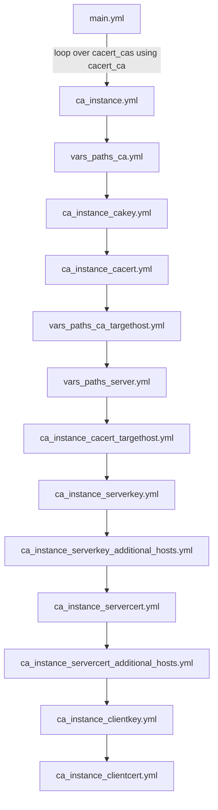

# imp1sh.ansible_managemynetwork.ansible_cacert

This role aims to make the process of certificate management as comfy as possible. This implies of course some opinionated stuff but at the same time the role tries to be flexible in its ability to reflect commonly needed attributes.
It also tries to be ephemeral meaning even in case of a CA private key loss or security breach you can remove old data by setting the attribue `state: absent` attribute and almost everything will be removed. Set state again to `present` and let run again. All your certificates / keys will be renewed. The reason for this role is to just conveniently get certificates from a self signed and self managed CA onto your hosts. Multiple CA are supported but not sub CAs. Each host will just automatically get a server cert that its common name is the `inventory_hostname` from Ansible, so typically the fqdn. This role tightly integrates into the `ansible_podman` role together with its plugin system. `ansible_podman` not only delivers containers to hosts but with its plugin system and `ansible_cacert` it will fully automate the delivery of services with configuration and certificates in an ephemeral way. Worst case scenario just redeploy the whole setup. The certs will also be new but as everything is automated it should be much of a hassle. (Infrastrurcture as Code / IaC).
CSR will never be written but always only be in memory during ansible runs. CA will also support Certificate Revocation Lists by default but this feature is untested.

Role supports:
- Debian (sticking to latest stable)
- OpenWrt (sticking to latest stable)

## Requirements:

- python3-cryptography for handling CSR stuff on the target machine and the CA management host.

## Variables
| Variable Name | Purpose |  Default ? | Type | Mandatory |
| - | - | - | - | - |
| cacert_ca_certfile | 
| cacert_ca_keyfile | 
| cacert_ca_manager_host | This is where the CA data is held. Keep this host secure. Has to be a hostname that ansible will accept for `delegate_to:`  | - | String | Yes |
| cacert_ca_validity_days |
| cacert_cacert_additionalpaths | 
| cacert_cas |
| cacert_filename_cacert |
| cacert_openssl_path_key_ca | 
| cacert_openssl_path_certificate_ca |
| cacert_openssl_path_certificate_client |
| cacert_openssl_path_certificate_server | 
| cacert_path_cacert | 
| cacert_path_cakey |
| cacert_tag_certificate |
| cacert_tag_clientcert |
| cacert_tag_clientkey |
| cacert_tag_privatekey | When a CA is being created this is a tag you can give for the filename tag. |

## Dynamic vars
Vars you do normally not set but are created by the role when running. 
| Variable Name | Purpose  | Type |
| - | - | - |
| cacert_ca_cert_existing | Contents of the CA certificate | dict (from ansible register function) |
| cacert_ca_csr | If a new CA cert is being created this role will also create a CSR in order to sign the CA certificate. |
| cacert_ca_privatekey | When a new CA is being created or read it will carry the private key for your CA | ? | 
| cacert_ca_cert | If a new CA cert is being created this role will of course create a CA certificate and register it in this var | dict (from ansible register function) |
| cacert_path_servercert | Builds the servercert path including the filename | String |
| cacert_path_serverkey | Builds the servercert private key path including the filename | String | 
| cacert_filename_servercert | Builds the servercert filename only | String |
| cacert_filename_serverkey | Builds the servercert's private key | String |

## Basic information

This role will affect the following hosts:
- `cacert_ca_manager_host`: User defined var that will specify the host the CA is being managed on aka *CA Manager Host*
- *Ansible target hosts*, i.e. the hosts the playbook will run on. They will automatically get the CA certificates installed as well as server cert. Optionally they can get a client cert by using the `cacert_clientcerts` variable.
- Server cert additional hosts, defined in `cacert_servercert_additionalhosts`. You might want to have the server certificate on others hosts as well. Use `cacert_servercert_additionalhosts` for that.

For the CA manager host the idea is to have a dedicated extra hardened maybe air gapped CA management host. In case you plan to go with decent security you will want to use that kind of concepts. Just set

```yaml
cacert_ca_manager_host: "myhostname.example.com"
```
This can of course also be the ansible management host but I strongly suggest not to put any of that data into git repo that syncs with any web based service. Again for securities sake. 

## Basic workflow



Here's an overview of the full role's workflow
- (main.yml) Installing required packages via imp1sh.ansible_managemynetwork.ansible_packages |
- ( main.yml) Loop over *cacert_cas*, loop varname: *cacert_ca* |
  - (ca_instance.yml) Configure vars and fetch facts for CA Manager host, mainly paths for keys and certificates
  - Create or read CA key
  - Create or read CA certificate


## Basic Ansible
The idea is to define an amount of CAs
```yaml
# CACERT ROLE
cacert_ca_manager_host: "myhostname.example.com"
cacert_cas:
  main0_rsa:
    state: "present"
    common_name: "Libcom.de root Certificate Authority"
    country_name: "DE"
    email_address: "camanager@example.com"
    organization_name: "Libcom.de"
    organizational_unit_name: "CA Managers"
    state_or_province_name: "Titz"
    locality_name: "Ottweiler"
    not_after: "+10y"
    not_before: "-2d"
    key:
      type: "RSA"
      backup: True
      passphrase: !vault |
            $ANSIBLE_VAULT;1.1;AES256
            36656539323063636134666637623863323566353434303739303837366433363033336634613166
            [...]
            3663336466346139353037316664636434616561663264393065
    cert:
      backup: True
  main1i_ecc:
    state: present
    common_name: "Libcom.de root CA (ECC alternative)"
    country_name: "DE"
    email_address: "jochen@libcom.de"
    organization_name: "Libcom.de"
    organizational_unit_name: "CA Managers"
    state_or_province_name: "Titz"
    locality_name: "Ottweiler"
    not_after: "+10y"
    not_before: "-2d"
    key:
      type: "ECC"
      curve: secp384r1
      backup: True
      passphrase: !vault |
            $ANSIBLE_VAULT;1.1;AES256
            36656539323063636134666637623863323566353434303739303837366433363033336634613166
            [...]
            3663336466346139353037316664636434616561663264393065
```

The resulting CA certs will not only be on the CA management host but also installed onto each host this Ansible role will run on. The CAs private key will only be on the CA management host and will have 0600 mode for security reasons.

The following settings normally done in ansible on group basis to avoid redundancy. Here you can make global settings on what settings to use for the server certs. If you don't specify it will be RSA 4096 bit by default. Role also supports eliptic curve.

cacert_servercert_organization_name: "Libcom.de"
cacert_servercert_organizational_unit_name: "DevOps"
cacert_servercert_country_name: "DE"
cacert_servercert_state_or_province_name: "Ottweiler"
cacert_servercert_email_address: "servercert_manager@example.com"
cacert_servercert_not_after: "+120w"
cacert_servercert_not_before: "-2d"
#cacert_servercert_bitsize: 4096
#cacert_servercert_type: "rsa"
#cacert_servercert_curve: 
  #cacert_servercert_passphrase: !vault |
  #          $ANSIBLE_VAULT;1.1;AES256
  #          31636364653837643739666264343662316430646536313766303265623139656438656664306436
  #          [...]
  #          6462363132653932353963333665336434393035633565656337

## Server and Client certs
For each ansible host there will be one server cert so you don't have to manually define server certs but you can define `cacert_servercert_altnames` in order to get additinal altnames (SAN). The certs will automatically land on each target host. For both *Debian* and *OpenWrt* that's `/etc/ssl/private` for the private keys and `/etc/ssl/certs` for the certificates. In some cases you may want to have the certs also to be in a different spot on the Ansible target machine. The following example show placements for PowerDNS Authoritative and PostgreSQL in podman containers.
```yaml
cacert_cacert_additionalpaths:
  - dest: "/mnt/cntr/unsynced/pdnsauth/0"
    state: "present"
    user: "953"
    group: "953"
  - dest: "/mnt/cntr/unsynced/psql/0/data"
    state: "present"
    user: "999"
    group: "999"
cacert_servercert_additionalpaths:
  - dest: "/mnt/cntr/unsynced/psql/0/data"
    state: "present"
    user: "999"
    group: "999"
cacert_serverkey_additionalpaths:
  - dest: "/mnt/cntr/unsynced/psql/0/data"
    state: "present"
    user: "999"
    group: "999"
cacert_servercert_altnames:
  - name: "psql0.example.com"
    prefix: "DNS"
  - name: "psql0"
    prefix: "DNS"
  - name: "psqlmaster.example.com"
    prefix: "DNS"
```
The state attributes are optional and will default to `present`.
