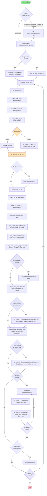

# imp1sh.ansible_managemynetwork.ansible_cacert

This role aims to make the process of certificate management as comfortable and easy as possible. This implies of course some opinionated stuff but at the same time the role tries to be flexible in its ability to reflect commonly needed attributes.
It also tries to be ephemeral, meaning that even in case of a CA private key loss or security breach, you can remove old data by setting the attribute `state: absent` and almost everything will be removed. Set state again to `present` and let it run again. All your certificates / keys will be renewed. The reason for this role is to just conveniently get certificates from a self signed and self managed CA onto your hosts. Multiple CA are supported but not sub CAs. Each host will just automatically get a **default cert** whose common name is the `inventory_hostname` from Ansible, so typically the fqdn. This role tightly integrates into the `ansible_podman` role together with its plugin system. `ansible_podman` not only delivers containers to hosts but with its plugin system and `ansible_cacert` it will fully automate the delivery of services with configuration and certificates in an ephemeral way. Worst case scenario just redeploy the whole setup. The certs will also be new but as everything is automated it should be much of a hassle. (Infrastructure as Code / IaC).
CSR will never be written but always only be in memory during ansible runs.

**Terminology:** the role distinguishes between the **default cert** (the automatic per-host server cert, CN = `inventory_hostname`) and **additional certs** (extra server certs you opt into via `cacert_additionalcerts`, e.g. wildcards). Every variable, task name and filename makes this distinction explicit so it is always clear which cert a task concerns.

**Time format:** all `not_after` / `not_before` values use relative timespecs understood by `community.crypto`: a sign (`+`/`-`) followed by combinations of `w` (weeks), `d` (days), `h` (hours), `m` (minutes), `s` (seconds). Years (`y`) and months are **not** supported — use weeks instead (e.g. `+520w` for ~10 years).

Role supports:
- Debian
- Fedora
- OpenWrt

## Requirements:

- `python3-cryptography` for handling CSR stuff on the target machine and the CA management host.
- When using OpenWrt imagebuilder support, the `ansible_openwrtimagebuilder` role must be run first to set up the imagebuilder environment.

## Migration from `cacert_servercert_*` (breaking)

Before this release the per-host server cert was controlled by `cacert_servercert_*` and `cacert_serverkey_*` variables. Those have been renamed to `cacert_defaultcert_*` and `cacert_defaultkey_*` to distinguish them clearly from the new `cacert_additionalcerts` feature. To upgrade, rename your variables:

| Old | New |
| - | - |
| `cacert_servercert_additionalhosts` | `cacert_defaultcert_additionalhosts` |
| `cacert_servercert_additionalpaths` | `cacert_defaultcert_additionalpaths` |
| `cacert_servercert_altnames` | `cacert_defaultcert_altnames` |
| `cacert_servercert_bitsize` | `cacert_defaultcert_bitsize` |
| `cacert_servercert_common_name` | `cacert_defaultcert_common_name` |
| `cacert_servercert_country_name` | `cacert_defaultcert_country_name` |
| `cacert_servercert_curve` | `cacert_defaultcert_curve` |
| `cacert_servercert_email_address` | `cacert_defaultcert_email_address` |
| `cacert_servercert_force` | `cacert_defaultcert_force` |
| `cacert_servercert_locality_name` | `cacert_defaultcert_locality_name` |
| `cacert_servercert_not_after` | `cacert_defaultcert_not_after` |
| `cacert_servercert_not_before` | `cacert_defaultcert_not_before` |
| `cacert_servercert_organization_name` | `cacert_defaultcert_organization_name` |
| `cacert_servercert_organizational_unit_name` | `cacert_defaultcert_organizational_unit_name` |
| `cacert_servercert_passphrase` | `cacert_defaultcert_passphrase` |
| `cacert_servercert_state_or_province_name` | `cacert_defaultcert_state_or_province_name` |
| `cacert_servercert_type` | `cacert_defaultcert_type` |
| `cacert_serverkey_additionalpaths` | `cacert_defaultkey_additionalpaths` |

The generated cert/key filenames are unchanged for the default cert (still `<cakey>_<inventory_hostname>_<tag>.pem`), so existing deployments keep working without re-issuing certificates. To opt out of the default cert entirely on a host, set `cacert_defaultcert_state: "absent"`.

## Variables
| Variable Name | Purpose | Default | Type | Mandatory |
| - | - | - | - | - |
| cacert_ca_manager_host | Hostname where CA data is stored. Keep this host secure. Must be a hostname that ansible will accept for `delegate_to:`. | - | String | Yes |
| cacert_cacert_additionalpaths | Optional list of additional paths where CA certificates should be copied. Each entry: dest, state, user, group. | - | List | No |
| cacert_additionalcerts | Optional list of **additional server certs** (e.g. wildcards) beyond the default cert. Each entry: id (mandatory, stable slug for filenames), common_name (mandatory), state, altnames, not_after, not_before, type, bitsize, curve, passphrase, force, organization_name, organizational_unit_name, country_name, state_or_province_name, locality_name, email_address, additionalpaths, key_additionalpaths. Unset fields inherit from the `cacert_defaultcert_*` scalars. | [] | List | No |
| cacert_browser_trust | Deploy Firefox/LibreWolf enterprise policies to trust the system CA store. | true | Boolean | No |
| cacert_cas | Dictionary of CA definitions. Each key is a CA identifier, value contains CA configuration: state, common_name, country_name, email_address, organization_name, organizational_unit_name, state_or_province_name, locality_name, not_after, not_before, key (dict with type, backup, passphrase, curve, etc.), cert (dict with backup). See example below. | {} | Dict | Yes |
| cacert_clientcert_bitsize | Key size in bits for client certificates. | 4096 | Integer | No |
| cacert_clientcert_curve | Curve name for ECC client certificates. | - | String | No |
| cacert_clientcert_force | Force regeneration of client certificates even if unchanged. | false | Boolean | No |
| cacert_clientcert_not_after | Validity period end for client certificates. | +54w | String | No |
| cacert_clientcert_not_before | Validity period start for client certificates. | -1d | String | No |
| cacert_clientcert_passphrase | Optional passphrase for client certificate private keys. | - | String | No |
| cacert_clientcert_type | Key type for client certificates (RSA or ECC). | RSA | String | No |
| cacert_clientcerts | Optional list of client certificate definitions. Each entry should contain: common_name, dest, state, user, group, not_after, not_before. | [] | List | No |
| cacert_defaultcert_additionalhosts | Optional list of additional hosts where the **default cert** should be copied. Each entry: targethost, targethostpath, targethostuser, targethostgroup, state, alsokey (bool). | - | List | No |
| cacert_defaultcert_additionalpaths | Optional list of additional paths where the **default cert** should be copied. Each entry: dest, state, user, group. | - | List | No |
| cacert_defaultcert_altnames | Optional list of Subject Alternative Names (SAN) for the **default cert**. Each entry: name, prefix (e.g., "DNS"). | - | List | No |
| cacert_defaultcert_bitsize | Key size in bits for the **default cert**. | 4096 | Integer | No |
| cacert_defaultcert_common_name | Common name for the **default cert**. | inventory_hostname | String | No |
| cacert_defaultcert_country_name | Country name for the **default cert**. | - | String | No |
| cacert_defaultcert_curve | Curve name for ECC **default cert** (e.g., "secp384r1"). | - | String | No |
| cacert_defaultcert_email_address | Email address for the **default cert**. | - | String | No |
| cacert_defaultcert_force | Force regeneration of the **default cert** even if unchanged. | false | Boolean | No |
| cacert_defaultcert_locality_name | Locality name for the **default cert**. | - | String | No |
| cacert_defaultcert_not_after | Validity period end for the **default cert** (e.g., "+120w"). | +52w | String | No |
| cacert_defaultcert_not_before | Validity period start for the **default cert** (e.g., "-2d"). | -1d | String | No |
| cacert_defaultcert_organization_name | Organization name for the **default cert**. | - | String | No |
| cacert_defaultcert_organizational_unit_name | Organizational unit name for the **default cert**. | - | String | No |
| cacert_defaultcert_passphrase | Optional passphrase for the **default cert** private key. | - | String | No |
| cacert_defaultcert_state | Lifecycle state of the **default cert**. Set to `absent` to skip generating and to remove the default cert on a host. | present | String | No |
| cacert_defaultcert_state_or_province_name | State or province name for the **default cert**. | - | String | No |
| cacert_defaultcert_type | Key type for the **default cert** (RSA or ECC). | RSA | String | No |
| cacert_defaultkey_additionalpaths | Optional list of additional paths where the **default cert** private key should be copied. Each entry: dest, state, user, group. | - | List | No |
| cacert_deployroot | Base path prefix for certificate and key files. Used for OpenWrt imagebuilder support. Automatically set by `ansible_openwrtimagebuilder` role. | "/" | String | No |
| cacert_runimagebuilder | Flag indicating if running in OpenWrt imagebuilder mode. Must be set to `true` manually when using imagebuilder. When true, skips package installation and trust store updates. | false | Boolean | No |
| cacert_tag_certificate | Filename tag for certificates. | certificate | String | No |
| cacert_tag_clientcert | Filename tag for client certificates. | clientcert | String | No |
| cacert_tag_clientkey | Filename tag for client keys. | clientkey | String | No |
| cacert_tag_privatekey | Filename tag for private keys. | privatekey | String | No |

**Note:** OS-specific variables (like `cacert_command_updatetruststore`, `cacert_openssl_path_*`, `cacert_packages`) are automatically set based on the target OS and should not be manually configured. These paths are automatically prefixed with `cacert_deployroot` to support OpenWrt imagebuilder scenarios.

## Dynamic vars
Variables created by the role during execution. Do not set these manually.
| Variable Name | Purpose | Type |
| - | - | - |
| cacert_ca_cert | CA certificate created/read by the role. Contains the certificate content. | Dict (from ansible register) |
| cacert_ca_cert_existing | Contents of existing CA certificate when present. | Dict (from ansible register) |
| cacert_ca_csr | Certificate Signing Request created for CA certificate. | Dict (from ansible register) |
| cacert_ca_privatekey | CA private key created/read by the role. | Dict (from ansible register) |
| cacert_clientcert_result | Client certificate created/signed by the role. | Dict (from ansible register) |
| cacert_defaultcert_existing | Contents of existing default cert when present. | Dict (from ansible register) |
| cacert_defaultcert_result | Default cert created/signed by the role. | Dict (from ansible register) |
| cacert_defaultkey_existing | Contents of existing default cert private key when copying to additional hosts. | Dict (from ansible register) |
| cacert_filename_cacert | Generated filename for CA certificate. | String |
| cacert_filename_cakey | Generated filename for CA private key. | String |
| cacert_filename_clientcert | Generated filename for client certificate. | String |
| cacert_filename_clientkey | Generated filename for client private key. | String |
| cacert_filename_defaultcert | Generated filename for the default cert. | String |
| cacert_filename_defaultkey | Generated filename for the default cert private key. | String |
| cacert_path_cacert | Full path to CA certificate on CA manager host. | String |
| cacert_path_cacert_targethost | Full path to CA certificate on target host. | String |
| cacert_path_cakey | Full path to CA private key on CA manager host. | String |
| cacert_path_cakey_targethost | Full path to CA private key on target host (if copied). | String |
| cacert_path_clientcert | Full path to client certificate. | String |
| cacert_path_clientkey | Full path to client private key. | String |
| cacert_path_defaultcert | Full path to the default cert. | String |
| cacert_path_defaultkey | Full path to the default cert private key. | String |

## Basic information

This role will affect the following hosts:
- `cacert_ca_manager_host`: User defined var that will specify the host the CA is being managed on aka *CA Manager Host*
- *Ansible target hosts*, i.e. the hosts the playbook will run on. They will automatically get the CA certificates installed as well as the default cert. Optionally they can get a client cert by using the `cacert_clientcerts` variable.
- Default cert additional hosts, defined in `cacert_defaultcert_additionalhosts`. You might want to have the default cert on other hosts as well. Use `cacert_defaultcert_additionalhosts` for that.

For the CA manager host the idea is to have a dedicated extra hardened maybe air gapped CA management host. In case you plan to go with decent security you will want to use that kind of concepts. Just set

```yaml
cacert_ca_manager_host: "myhostname.example.com"
```
This can of course also be the ansible management host but I strongly suggest not to put any of that data into git repo that syncs with any web based service. Again for securities sake. 

## Basic workflow


```mermaid
flowchart TD
    Start([main.yml Start]) --> DetectImagebuilder{Detect<br/>imagebuilder?}
    DetectImagebuilder -->|openwrt_imagebuilder_deployroot<br/>defined| SetImagebuilder[Set cacert_runimagebuilder: true]
    DetectImagebuilder -->|Not defined| LoadOSVars[Load OS vars<br/>distribution/family specific]
    SetImagebuilder --> LoadOSVars
    LoadOSVars --> InstallPackages{Imagebuilder<br/>mode?}
    InstallPackages -->|No| InstallPkgs[Install required packages<br/>python3-cryptography]
    InstallPackages -->|Yes| SkipPkgs[Skip package installation]
    InstallPkgs --> LoopCA[Loop over cacert_cas]
    SkipPkgs --> LoopCA
    
    LoopCA --> CAInstance[ca_instance.yml]
    
    CAInstance --> GatherFacts[Gather facts for CA Manager Host]
    GatherFacts --> LoadOSVarsCA[Load OS vars for CA Manager Host]
    LoadOSVarsCA --> VarsPathsCA[vars_paths_ca.yml<br/>Build CA paths]
    
    VarsPathsCA --> CAKey{CA state?}
    CAKey -->|absent| RemoveCAKey[Remove CA Key]
    CAKey -->|present| CreateCAKey[ca_instance_cakey.yml<br/>Create/Read CA Key]
    
    RemoveCAKey --> CACert[ca_instance_cacert.yml]
    CreateCAKey --> CACert
    
    CACert --> CheckCACert{CA Cert exists?}
    CheckCACert -->|Yes| ReadCACert[Read existing CA Cert]
    CheckCACert -->|No| CreateCSR[Create CSR for CA]
    ReadCACert --> CreateCSR
    CreateCSR --> SignCA[Sign CA Cert self-signed]
    SignCA --> WriteCA[Write CA Cert to CA Manager Host]
    
    WriteCA --> LoadOSVarsTarget[Load OS vars for Target Host]
    LoadOSVarsTarget --> VarsPathsCATarget[vars_paths_ca_targethost.yml<br/>Build CA paths for target]
    VarsPathsCATarget --> VarsPathsDefault[vars_paths_defaultcert.yml<br/>Build default cert/key paths]
    
    VarsPathsDefault --> CACertTarget[ca_instance_cacert_targethost.yml<br/>Install CA Cert on Target Host]
    CACertTarget --> AdditionalPathsCA{Additional paths<br/>defined?}
    AdditionalPathsCA -->|Yes| CopyCAAdditional[Copy CA Cert to additional paths]
    AdditionalPathsCA -->|No| DefaultKey
    
    CopyCAAdditional --> DefaultKey[ca_instance_defaultkey.yml<br/>Create Default Key on Target]
    
    DefaultKey --> DefaultKeyAdditional{Additional hosts<br/>for default key?}
    DefaultKeyAdditional -->|Yes| DefaultKeyAddHosts[ca_instance_defaultkey_additional_hosts.yml<br/>Copy Default Key to additional hosts]
    DefaultKeyAdditional -->|No| DefaultCert
    
    DefaultKeyAddHosts --> DefaultCert[ca_instance_defaultcert.yml<br/>Create CSR and Sign Default Cert]
    DefaultCert --> DefaultCertAdditional{Additional hosts<br/>for default cert?}
    DefaultCertAdditional -->|Yes| DefaultCertAddHosts[ca_instance_defaultcert_additional_hosts.yml<br/>Copy Default Cert to additional hosts]
    DefaultCertAdditional -->|No| ClientCerts
    
    DefaultCertAddHosts --> ClientCerts{Client certs<br/>defined?}
    ClientCerts -->|No| UpdateTrustStore
    ClientCerts -->|Yes| LoopClient[Loop over cacert_clientcerts]
    
    LoopClient --> ClientKey[ca_instance_clientkey.yml<br/>Create Client Key]
    ClientKey --> ClientCert[ca_instance_clientcert.yml<br/>Create CSR and Sign Client Cert]
    ClientCert --> MoreClients{More client<br/>certs?}
    MoreClients -->|Yes| LoopClient
    MoreClients -->|No| UpdateTrustStore
    
    UpdateTrustStore{OpenWrt or<br/>Imagebuilder?} -->|No| UpdateTrust[Update trust store]
    UpdateTrustStore -->|Yes| MoreCAs
    UpdateTrust --> MoreCAs{More CAs<br/>in loop?}
    MoreCAs -->|Yes| LoopCA
    MoreCAs -->|No| EndProcess([End])
    
    style Start fill:#90EE90
    style EndProcess fill:#FFB6C1
    style CAKey fill:#FFE4B5
    style CACert fill:#FFE4B5
    style DefaultKeyAdditional fill:#E6E6FA
    style DefaultCertAdditional fill:#E6E6FA
    style ClientCerts fill:#E6E6FA
    style AdditionalPathsCA fill:#E6E6FA
    style MoreCAs fill:#E6E6FA
```

## Basic Ansible
The idea is to define an amount of CAs
```yaml
# CACERT ROLE
cacert_ca_manager_host: "myhostname.example.com"
cacert_cas:
  main0_rsa:
    state: "present"
    common_name: "Libcom.de root Certificate Authority"
    country_name: "DE"
    email_address: "camanager@example.com"
    organization_name: "Libcom.de"
    organizational_unit_name: "CA Managers"
    state_or_province_name: "Titz"
    locality_name: "Ottweiler"
    not_after: "+520w"
    not_before: "-2d"
    key:
      type: "RSA"
      backup: True
      passphrase: !vault |
            $ANSIBLE_VAULT;1.1;AES256
            36656539323063636134666637623863323566353434303739303837366433363033336634613166
            [...]
            3663336466346139353037316664636434616561663264393065
    cert:
      backup: True
  main1i_ecc:
    state: present
    common_name: "Libcom.de root CA (ECC alternative)"
    country_name: "DE"
    email_address: "jochen@libcom.de"
    organization_name: "Libcom.de"
    organizational_unit_name: "CA Managers"
    state_or_province_name: "Titz"
    locality_name: "Ottweiler"
    not_after: "+520w"
    not_before: "-2d"
    key:
      type: "ECC"
      curve: secp384r1
      backup: True
      passphrase: !vault |
            $ANSIBLE_VAULT;1.1;AES256
            36656539323063636134666637623863323566353434303739303837366433363033336634613166
            [...]
            3663336466346139353037316664636434616561663264393065
```

The resulting CA certs will not only be on the CA management host but also installed onto each host this Ansible role will run on. The CAs private key will only be on the CA management host and will have 0600 mode for security reasons.

**Trust Store Updates**: On Debian and Fedora systems, the role automatically runs the appropriate trust store update command (`update-ca-certificates` for Debian, `update-ca-trust extract` for Fedora) after installing CA certificates. This step is skipped for OpenWrt (which doesn't have a standard trust store update mechanism) and when running in imagebuilder mode (where trust store updates are not applicable).

The following settings normally done in ansible on group basis to avoid redundancy. Here you can make global settings on what settings to use for the default cert. If you don't specify it will be RSA 4096 bit by default. Role also supports eliptic curve.
```
cacert_defaultcert_organization_name: "Libcom.de"
cacert_defaultcert_organizational_unit_name: "DevOps"
cacert_defaultcert_country_name: "DE"
cacert_defaultcert_state_or_province_name: "Ottweiler"
cacert_defaultcert_email_address: "defaultcert_manager@example.com"
cacert_defaultcert_not_after: "+120w"
cacert_defaultcert_not_before: "-2d"
#cacert_defaultcert_bitsize: 4096
#cacert_defaultcert_type: "rsa"
#cacert_defaultcert_curve: 
  #cacert_defaultcert_passphrase: !vault |
  #          $ANSIBLE_VAULT;1.1;AES256
  #          31636364653837643739666264343662316430646536313766303265623139656438656664306436
  #          [...]
  #          6462363132653932353963333665336434393035633565656337
```

## Multiple CAs

You can define more than one CA in `cacert_cas` (e.g. an RSA root and an ECC root for algorithm agility). The role iterates over every CA and, **for each CA**, issues the full set of certs on every target host:

- the **default cert** (one per CA),
- every **additional cert** in `cacert_additionalcerts` (one per CA per entry),
- every **client cert** in `cacert_clientcerts` (one per CA per entry).

There is **no per-cert CA binding**: a cert spec cannot ask to be signed by a specific CA. With N CAs you therefore get N copies of each cert, distinguished only by the CA-identifier filename prefix (`<cakey>_<id>_<tag>.pem`). Each copy is signed by a different CA.

This is deliberate when you want redundant chains (clients pick whichever CA they trust), but it multiplies the issued artefacts linearly with the number of CAs. If you only ever use one CA, the multiplier is invisible. Selective signing ("this additional cert should be signed by CA X only") is not implemented today; a future `ca:` key on each cert spec would add it.

## OS-Specific Paths

The role automatically sets certificate and key paths based on the target OS:

- **Debian**: CA certificates go to `/usr/local/share/ca-certificates`, default/additional/client certs to `/etc/ssl/certs`, keys to `/etc/ssl/private`
- **Fedora**: CA certificates go to `/etc/pki/ca-trust/source/anchors/`, default/additional/client certs to `/etc/pki/tls/certs`, keys to `/etc/pki/tls/private/` or `/etc/ssl/private`
- **OpenWrt**: CA certificates and default/additional/client certs go to `/etc/ssl/certs`, keys to `/etc/ssl/private` or `/etc/ssl/ca/private`

All paths are automatically prefixed with `cacert_deployroot` (defaults to `"/"`), which allows the role to work with OpenWrt imagebuilder by deploying files to the imagebuilder's files directory instead of the live system.

## OpenWrt Imagebuilder Support

This role supports OpenWrt imagebuilder scenarios through integration with the `ansible_openwrtimagebuilder` role. When running in imagebuilder mode:

- Certificate and key files are deployed to the imagebuilder's files directory instead of the live system
- Package installation is skipped (packages will be included in the image during build)
- Trust store updates are skipped (not applicable for image preparation)

**Example playbook for imagebuilder:**
```yaml
- name: Build OpenWrt image with certificates
  hosts: openwrt_imagebuilder
  vars:
    ansible_distribution: OpenWrt
    ansible_os_family: OpenWrt
    cacert_runimagebuilder: true  # Enable imagebuilder mode
    cacert_ca_manager_host: "ca.example.com"
    cacert_cas:
      main_ca:
        state: "present"
        common_name: "My CA"
        # ... other CA config ...
  tasks:
    - name: Prepare imagebuilder
      ansible.builtin.import_role:
        name: imp1sh.ansible_managemynetwork.ansible_openwrtimagebuilder
        tasks_from: prepare
    
    - name: Deploy certificates to image
      ansible.builtin.import_role:
        name: imp1sh.ansible_managemynetwork.ansible_cacert
    
    - name: Build image
      ansible.builtin.import_role:
        name: imp1sh.ansible_managemynetwork.ansible_openwrtimagebuilder
        tasks_from: build
```

**Note:** The `ansible_openwrtimagebuilder` role automatically sets `cacert_deployroot` to point to the imagebuilder's files directory. You must manually set `cacert_runimagebuilder: true` in your playbook to enable imagebuilder mode.

## Default cert and Client certs
For each ansible host there will be one default cert so you don't have to manually define it but you can define `cacert_defaultcert_altnames` in order to get additional altnames (SAN). The default cert will automatically land on each target host at the OS-specific paths mentioned above. In some cases you may want to have the cert also to be in a different spot on the Ansible target machine. The following example shows placements for PowerDNS Authoritative and PostgreSQL in podman containers.
```yaml
cacert_cacert_additionalpaths:
  - dest: "/mnt/cntr/unsynced/pdnsauth/0"
    state: "present"
    user: "953"
    group: "953"
  - dest: "/mnt/cntr/unsynced/psql/0/data"
    state: "present"
    user: "999"
    group: "999"
cacert_defaultcert_additionalpaths:
  - dest: "/mnt/cntr/unsynced/psql/0/data"
    state: "present"
    user: "999"
    group: "999"
cacert_defaultkey_additionalpaths:
  - dest: "/mnt/cntr/unsynced/psql/0/data"
    state: "present"
    user: "999"
    group: "999"
cacert_defaultcert_altnames:
  - name: "psql0.example.com"
    prefix: "DNS"
  - name: "psql0"
    prefix: "DNS"
  - name: "psqlmaster.example.com"
    prefix: "DNS"
```
The state attributes are optional and will default to `present`.

To opt out of the default cert on a host (e.g. when you only want additional certs), set:
```yaml
cacert_defaultcert_state: "absent"
```

## Additional certs
Beyond the automatic default cert, you can request extra server certs via `cacert_additionalcerts`. Typical use case: wildcard certificates for a reverse proxy (e.g. traefik). Each entry requires a stable `id` (used in the generated filename) and a `common_name`; everything else inherits from the `cacert_defaultcert_*` scalars or defaults to sane values.

```yaml
cacert_additionalcerts:
  - id: "wildcard_lpv4"
    common_name: "*.lpv4.net"
    altnames:
      - name: "*.lpv4.net"
        prefix: "DNS"
    additionalpaths:
      - dest: "/mnt/cntr/unsynced/traefik/0/etc"
        state: present
        user: root
        group: root
    key_additionalpaths:
      - dest: "/mnt/cntr/unsynced/traefik/0/etc"
        state: present
        user: root
        group: root
  - id: "wildcard_libcom"
    common_name: "*.libcom.de"
    altnames:
      - name: "*.libcom.de"
        prefix: "DNS"
    additionalpaths:
      - dest: "/mnt/cntr/unsynced/traefik/0/etc"
        state: present
        user: root
        group: root
    key_additionalpaths:
      - dest: "/mnt/cntr/unsynced/traefik/0/etc"
        state: present
        user: root
        group: root
```

Generated filenames follow the same scheme as the default cert: `<cakey>_<id>_<tag>.pem` (e.g. `libcom_root_wildcard_lpv4_certificate.pem`). The certs land in the OS-specific server-cert directory (`/etc/ssl/certs` on Debian) plus any `additionalpaths` you specify.

Rules enforced by `checks.yml`:
- `id` is mandatory, non-empty, and must not equal `inventory_hostname` (reserved for the default cert).
- `id`s must be unique across all additional certs.
- `common_name` is mandatory.
- `state` (if set) must be `present` or `absent`.

Set `state: absent` to remove an additional cert and its key; the role cleans up `additionalpaths` copies too.
